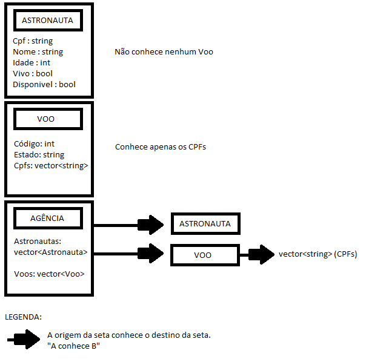

# Diário da atividade

Escreva com as suas palavras.
Frases curtas bastam.
Não cole a conversa inteira com a IA.
Cole só os pedidos que você enviou.

## Ambiente

- Versão do OpenCode: 1.18.31
- Modelo usado: Ling 3.0 Flash Fin

## Parte 1: antes de programar

Fiz o desenho no paint.

- O que cada classe guarda: Está no desenho
- O que acontece em `LANCAR_VOO 10`, em palavras: A agência procura o voo de código 10. Após isso, verifica se o voo está no estado planejado e se possui pelo menos um astronauta a bordo. Para cada CPF que consta no voo, a Agencia procura o astronauta correspondente e verifica se ele está vivo e disponível para o voo. Após todas as verificações serem aprovadas a agencia manda cada astronauta embarcar e manda o voo alterar seu estado para em curso.
- Uma dúvida que eu tinha antes de começar: Como organizar toda a estrutura do projeto, mas após ver que tinha um esqueleto no PDF disponibilizado pelo professor, ficou mais claro o que eu deveria fazer.

## Parte 1: uso de IA para entender algo

- O que perguntei (ou "não usei"): Perguntei para a IA como compilar usando powershell pois não estava conseguindo usar o Git Push, mas posteriormente consegui usar o Git Push normalmente.
- O que aprendi: Os comandos do Git Push no PowerShell.

## Primeiro contato: revisão sem editar

- As três melhorias que a IA sugeriu, em uma linha cada:
- A que escolhi e por quê:
- O que mudou no código, e se os seis testes continuaram passando:
- O que entendi que não sabia antes:

## Missão 1: LISTAR_ASTRONAUTAS e HISTORICO

- Primeira mensagem (o pedido do plano):
- O plano que a IA apresentou, resumido:
- Mudei algo no plano antes de liberar?
- Resultado de `testar.sh missao1` e de `testar.sh parte1`:
- Precisei refazer? O que mudou no pedido:

## Missão 2: SALVAR e CARREGAR

- Primeira mensagem:
- O plano, resumido:
- O formato do arquivo (cole cinco linhas do `dados_teste.txt`):
- Resultado de `testar.sh missao2` e de `testar.sh parte1`:
- Precisei refazer? O que mudou no pedido:

## Missão 3: RELATORIO

- Primeira mensagem:
- O plano, resumido:
- Resultado de `testar.sh missao3` e de `testar.sh parte1`:
- Precisei refazer? O que mudou no pedido:

## Missão 4: livre

- O que escolhi e por quê:
- O comando novo, a saída que eu esperava e o nome do meu arquivo de comandos
  (escritos antes de pedir):
- Primeira mensagem:
- O que veio, comparado com o que eu esperava:
- `testar.sh parte1` continuou passando?
- Aceitei, ajustei ou descartei? Por quê:

## Fechamento

- O que a IA fez que eu não conseguiria fazer sozinho nesse prazo:
- Onde ela errou ou fez algo que eu não pedi:
- O que eu faria diferente da próxima vez:
